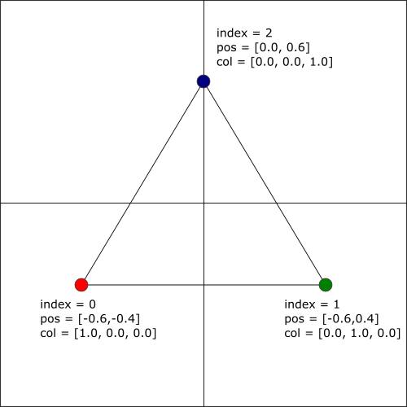
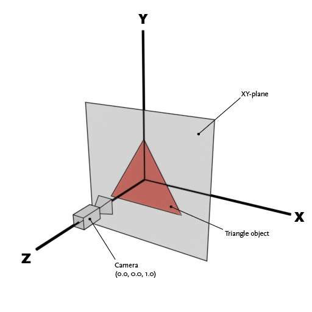
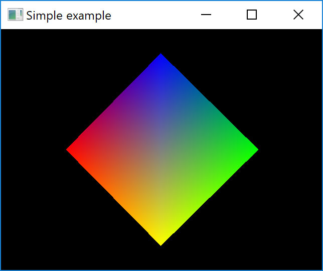

# Lesson 01 : Compiling and running an OpenGL program

## Learning goals
* Understand how to use the `glfw` library
* Understanding the program structure of an OpenGL program
* Compiling and executing your first OpenGL program
* Vertex Array Objects (VAO) and Vertex Buffer Objects (VBO)
* Conceptually understanding OpenGL Shading Language (GLSL)
* Conceptually understanding attributes and uniforms

## Compilation instructions
```
mkdir build
cd build
cmake ..\lesson01 -G "NMake Makefiles"
nmake
```

## Running the program
```
occ-lesson-01
```


## Explanation
This short program renders a colored triangle (as seen above). We recommend that you keep another windows open with the [source code](main.cpp) alongside this explanation. The best way to understand code is to go through it in detail and figure out what each command does. 

First, we need to produce a canvas on which we are going to render. This is done using the `glfw` library which generates a window for us. The `glfw` library provides a simple API for creating windows, contexts and surfaces, and receiving input and events. Starting from the `main` loop in [main.cpp](lesson01/main.cpp), you can see that we initialize a `GLFWwindow*` pointer, create a new window and make it the active context. There are a variety of other `glfw` related functions which I leave as an exercise to the reader to figure out their purpose. The [glfw documentation](http://www.glfw.org/documentation.html) is quite extensive and should provide as a proper reference.

The rendering of the triangle is executed on a graphical processing unit (GPU). This requires us to define data and routines that operate on the data. Both need to be communicated to the gpu. Data is communicated in the form of Vertex Array Objects (VAO) and Vertex Buffer Objects (VBO), whereas routines are communicated in the form of OpenGL Shading Language (GLSL) programs, called shaders. Let us first start by explaining how data is communicated to the GPU after which we follow up by explaining how we can build shaders.

### Data

The data for the single triangle is provided using two `float`-arrays, one for the vertex positions and one for the colors. A third `unsigned int`-array is used to convey the indices of the triangle. Here, it is the trivial array `{0,1,2}`, which is interpreted as that the first two/three floats of the position/color array correspond to vertex 0, the second two/three floats of the position/color array correspond to vertex 1, and so on. (how the program knows whether to take "steps" of two or three for the position and color arrays, respectively, I will explain further below). A schematic representation of our triangle is provided in the image below. By convention, the indices are placed in such a way that the face of the triangle that is pointing towards you is in a counter-clockwise fashion. (At least, that is the default setting. In principle, OpenGL allows you to chose a clockwise fashion.)



To place the triangle data on the gpu, we need to construct a VAO and a VBO for each array, here three in total. Hence, we need the following instructions:

```
GLuint vao, vbo[3];
glGenVertexArrays(1, &vao);
glBindVertexArray(vao);
glGenBuffers(3, vbo);
```

We create unsigned integers to hold references to the objects. Next, we create a single VAO. We bind that VAO and then construct three VBOs. In other words, we have constructed the buffers, but have not provided any data to them, which we will do up next.

The data is already defined in our C++ program in the form of three arrays. The data resides at the moment only on the CPU (or memory), but needs to be transferred to the GPU. This is done using the following instructions:

```
// bind vertices
glBindBuffer(GL_ARRAY_BUFFER, vbo[0]);
glBufferData(GL_ARRAY_BUFFER, 6 * sizeof(float) * 3, &vertices[0], GL_STATIC_DRAW);
glEnableVertexAttribArray(0);
glVertexAttribPointer(0, 2, GL_FLOAT, GL_FALSE, 0, 0);

// bind colors
glBindBuffer(GL_ARRAY_BUFFER, vbo[1]);
glBufferData(GL_ARRAY_BUFFER, 9 * sizeof(float) * 3, &colors[0], GL_STATIC_DRAW);
glEnableVertexAttribArray(1);
glVertexAttribPointer(1, 3, GL_FLOAT, GL_FALSE, 0, 0);

// bind indices
glBindBuffer(GL_ELEMENT_ARRAY_BUFFER, vbo[2]);
glBufferData(GL_ELEMENT_ARRAY_BUFFER, 3 * sizeof(unsigned int), &indices[0], GL_STATIC_DRAW);
glBindVertexArray(0);
```

First, we need to bind the buffer. Next, we need to copy the buffer data from the cpu to the gpu. We do this by providing a pointer to the first element (third parameter of the `glBufferData` function) and the size in bytes of the buffer (second parameter of the function). The first parameter represents the type of the buffer (`GL_ARRAY_BUFFER` for the 'raw' data and `GL_ELEMENT_ARRAY_BUFFER` for the indices). The fourth parameter informs the gpu whether to expect that the data will change significantly between draw calls or not. `GL_STATIC_DRAW` indicates that the gpu should consider the data to remain constant between draw calls.
Next, we enable the generic vertex attribute array and specify the location and data format of the array of generic vertex attributes to use when rendering. This is done by `glEnableVertexAttribArray` and `glVertexAttribPointer` respectively. In `glVertexAttribPointer`, the first parameter corresponds to the index of the generic vertex attribute array (here, index 0 for positions and index 1 for colors). The second parameter defines the type (`GL_FLOAT`), the third parameter indicates whether the data is normalized (in our case not, hence `GL_FALSE`) and the fourth and fifth parameters define the stride and offset which is 0 in both cases. Note that for the indices, we do not need to use `glEnableVertexAttribArray` and `glVertexAttribPointer` instruction.

### Shaders
Shaders are relatively small programs executed on the gpu that act upon the data as shown above. We need at least two shaders, which is the vertex shader and the fragment shader. The vertex shader acts upon the positions of the vertices, whereas the fragment shader deals with the colors. The vertex shader ensures that each vertex is transformed from its model coordinates to the screen coordinates. We use a series of matrix transformations for this. The exact nature of these matrix transformation is outside the scope of this lesson, but we will discuss this in a future lesson.

For now, we will focus on how these Shaders are defined, compiled and executed on the gpu. Shaders are defined in the OpenGL Shader Language (GLSL), which looks a lot like conventional C. We have a short GLSL program for the vertex as well as for the fragment shader, which are stored in `main.cpp` as a `char`-array:

```
/*
 * Vertex shader program
 */
static const char* vertex_shader_text =
"#version 330 core\n"
"uniform mat4 mvp;\n"
"in vec2 pos;\n"
"in vec3 col;\n"
"out vec3 color;\n"
"void main()\n"
"{\n"
"    gl_Position = mvp * vec4(pos, 0.0, 1.0);\n"
"    color = col;\n"
"}\n";

/*
 * fragment shader program
 */
static const char* fragment_shader_text =
"#version 330 core\n"
"in vec3 color;\n"
"out vec4 outcol;\n"
"void main()\n"
"{\n"
"    outcol = vec4(color, 1.0);\n"
"}\n";
```

The vertex shader and the fragment are connected in such a way that the output of the vertex shader acts as input for the fragment shader. The vertex shader receives the data defined in the previous section, both the vertex position as well as the colors. The positions are transformed to screen coordinates using the `mvp` shader whereas the colors are simply passed unaltered to the fragment shader. In the fragment shader, only an alpha channel is added to give a final 4-vector containing the color.

The two programs shown above are compiled and put on the gpu using the following instructions:

```
// load vertex shader
vertex_shader = glCreateShader(GL_VERTEX_SHADER);
glShaderSource(vertex_shader, 1, &vertex_shader_text, NULL);
glCompileShader(vertex_shader);
check_shader_error(vertex_shader, GL_COMPILE_STATUS, false, "Error: Shader compilation failed: ");

// load fragment shader
fragment_shader = glCreateShader(GL_FRAGMENT_SHADER);
glShaderSource(fragment_shader, 1, &fragment_shader_text, NULL);
glCompileShader(fragment_shader);
check_shader_error(fragment_shader, GL_COMPILE_STATUS, false, "Error: Shader compilation failed: ");

// construct program and attach shaders
program = glCreateProgram();
glAttachShader(program, vertex_shader);
glAttachShader(program, fragment_shader);

// bind attributes    
glBindAttribLocation(program, 0, "pos");
glBindAttribLocation(program, 1, "col");

// always link after binding attributes
glLinkProgram(program);
check_shader_error(program, GL_LINK_STATUS, true, "Program linking failed: ");
glValidateProgram(program);
check_shader_error(program, GL_VALIDATE_STATUS, true, "Program validation failed: ");

// set uniform variables in shader after linking
mvp_location = glGetUniformLocation(program, "mvp");
```

A shader is created using `glCreateShader`, which takes a single argument specifying the shader type (here: `GL_VERTEX_SHADER` or `GL_FRAGMENT_SHADER`, but there exist other types). Next, the source code for the Shader is set using `glShaderSource`. Then, the code is compiled using `glCompileShader` and finally we check for any errors. After compiling and checking both the vertex as well as the fragment shader, we create a single Shader program using `glCreateProgram`. The two individual shaders are attached to this program using `glAttachShader`. The data previously specified in our VBOs needs to be connected to the shader. We do this using `glBindAttribLocation`. Then we link and validate our program and finally we set a uniform variables using `glGetUniformLocation`.

Note the particular order of the instructions:
1. Read shader sources and compile these
2. Create a shader program and attach the shaders
3. Bind all attributes
4. Link and validate the shader program
5. Get locations for the uniforms

### Attributes and Uniforms

In the previous two sections we already briefly touched upon the concept of attributes and uniforms. Herein, we wish to emphasize upon the differences between the two. Attributes are a form of data that may change per vertex, such as the position and the color. Uniforms on the other hand are the same for all vertices. This is clear from our shader code. Our triangle consists of three vertices, each holding a set of coordinates and colors. The `mvp`-matrix acts upon these positions, but the matrix itself is the same for all three vertices. Hence, the vertex positions are an attribute, whereas the `mvp`-matrix is a uniform.

In our program, we defined the attributes and uniforms using the `glBindAttribLocation` and `glGetUniformLocation` functions, respectively. For the attributes, the values were copied to the GPU using the `glBufferData` instruction. For the `mvp`-uniform, we are going to use the `glUniformMatrix4fv` function, as we are going to copy a 4x4 matrix. For other data types, other functions exists. An overview can be found [here](https://www.khronos.org/registry/OpenGL-Refpages/gl4/html/glUniform.xhtml). 

The role of the `mvp` matrix is to transform the model from object space to clip space. We will touch upon this process in much more detail in the [next lesson](../lesson2/README.md). For the time being, it suffices to know that we constructed the `mvp` matrix in such a way that the triangle object is located on the XY-plane and the camera is at position (0.0, 0.0, 1.0), looking at the origin (0.0, 0.0, 0.0) and has its up vector pointing in the direction of the y-axis. See the image below for an schematic depiction. 



## Frame updates

A rotation is applied to our triangle in such a way that it is rotating around the y-axis. Every frame, the values in the `mvp`-matrix are updated to account for this rotation and the `mvp`-matrix is copied to the GPU. The complete source code for the construction of `mvp` is as follows

```
 glm::mat4 model = glm::rotate((float) glfwGetTime(), glm::vec3(0.0f, 1.0f, 0.0f));
glm::mat4 view = glm::lookAt(glm::vec3(0.0f, 0.0f, 1.0f), glm::vec3(0.0f, 0.0f, 0.0f), glm::vec3(0.0f, 1.0f, 0.0f));
glm::mat4 projection = glm::ortho(-ratio, ratio, -1.0f, 1.0f, 0.01f, 10.0f);
glm::mat4 mvp = projection * view * model;
glUseProgram(program);
glUniformMatrix4fv(mvp_location, 1, GL_FALSE, &mvp[0][0]);
```

You can see in the source code that these instructions are placed inside a loop. The loop is executed every frame. Simply told, in the loop the canvas is cleared, the mvp matrix is constructed and copied to the gpu, a draw call for the triangle is executed and finally the new frame is shown. This last instruction (showing the new frame), requires a bit more explanation. In principle, all draw calls act upon a 'passive' canvas, whereas the frame shown on the screen is the 'active' canvas. Once all draw calls have been performed, the two canvases swap (`glfwSwapBuffers`) and the active canvas becomes the passive and vice versa. The advantage of this procedure is that the user does not see the drawing process, but is immediately given the final frame image. A nice explanation is given in [this StackExchange post](https://computergraphics.stackexchange.com/questions/4550/how-double-buffers-works-in-opengl).

## Summary
In this first lesson, we constructed a simple OpenGL program wherein we rendered a rotating triangle. In order to do so, we defined the coordinates of the triangle (in model space) and copied these coordinates to the GPU in the form of attributes. To display the triangle and account for the rotation, we used an `mvp`-matrix that we updated every frame. The `mvp`-matrix was used as a uniform. The instructions to transform the triangle coordinates on the GPU are written in a GLSL Shader program. Two such shaders are necessary, which are a vertex shader (accounting for the transformation) and a fragment shader (accounting for the coloring). Finally, we have used `glfw` to create a window, make it active and create a surface upon which OpenGL can act in order to update the frame.

## Exercises

To further practice with the learning goals of this lesson. A series of exercises are introduced as can be found below. Solution to these exercises are given [here](solutions.md)

### Exercise 01: Changing c-style arrays to std::vector
On lines 46-49 of `main.cpp`, c-style vectors are being used. Change these to `std::vector`. What is the advantage of doing so? What else do you need to change in the script to let everything work accordingly? See lines 157-172.

### Exercise 02: Changing the colors
Make the triangle a pure red color. You can do this in two ways, either by changing the color values in `main.cpp` or by changing the fragment shader. What is the main difference?

### Exercise 03: Make a square
You can build a square as a combination of two triangles. Adjust the positions, colors, and indices in such a way that they contain two triangles. Note that these two triangles share two vertices, such that there are in total only 4 distinct vertices. Can you make clever use of the indices array such that the vertices and colors array only need 8 and 12 values, respectively?

### Exercise 04: Make a tetrahedron
Build a tetrahedron by defining four vertices and connect these as four triangles. Consult [this wiki page](https://en.wikipedia.org/wiki/Tetrahedron#Formulas_for_a_regular_tetrahedron) for the coordinates of the vertices of a tetrahedron. You need to expand your vertices array to also hold z-values, change the line that reads in the vertex positions in the VBO and the vertex shader program. Your results will look something like the image below. What goes wrong with this rendering and can you guess why that is? (think about overlapping triangles)



## Further reading and tips
* A very good tutorial (with significant overlap with this lesson) is provided [here](http://www.opengl-tutorial.org/beginners-tutorials/tutorial-2-the-first-triangle/).
* More information about each of the OpenGL functions can be found at the [OpenGL references pages](https://www.khronos.org/registry/OpenGL-Refpages/gl4/html/), although if you Google any single function the first entry is probably one of the pages in this source.
