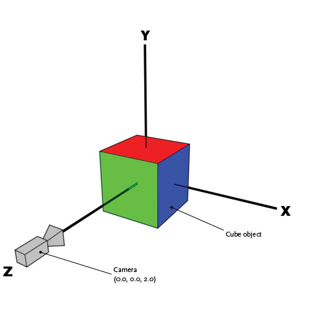

# Lesson 02 : Model, View, Perspective

## Learning goals
* Understanding the different matrix transformations involved
* Construct matrices using the GLM library

## Compilation instructions
```
mkdir build
cd build
cmake ..\lesson02 -G "NMake Makefiles"
nmake
```

## Running the program
```
occ-lesson-02
```

## The model
In this lesson, we are going to focus on the different matrix operations that are applied to a model in order to render it on the screen. In the [previous lesson](../lesson01/README.md), we used a flat triangle as our model. In this lesson, we are going to use a cube where each face of the cube has a different color. The cube is rotated around the (1,1,1) axes as shown by the image below


If you look at the two data arrays which make up the cube. you can see that the length of each edge of the cube is 1.0 and the cube is centered at the origin. The front face (for example) is green and the bottom face is colored red. Furthermore, you can see that each face has its own set of vertices. You might wonder why the faces cannot simply share the vertex positions. Instead of having to define 24 vertices, we only had to define 8 of them. The reason for this is as follows. A single vertex cannot have multiple color values. Since each facet has its own color, this means that we have to redefine the vertex for each color. Thus, we have 24 vertices in total.

A schematic depiction of the position and orientation of the cube, the camera and the coordinate system is provided in the image below.



## The pipeline

The whole set of matrix transformation that need to be applied to the model are represented schematically by the image below.


Our task is to convert from object space to normalized device space by constructing the `mvp`-matrix. The `glViewPort` command takes care of the final conversion to window space, upon which the image is visualized. To exemplify this process, let us consider the following `mvp`-matrix which contains the actual values as used in our [small program](main.cpp) when no rotation has been applied. (We will not do this calculation in this lesson, but please believe me that the numbers are correct)

```
1.344443, 0.000000,  0.000000,  0.000000
0.000000, 1.792591,  0.000000,  0.000000
0.000000, 0.000000, -1.002002, -1.000000
0.000000, 0.000000,  1.983984,  2.000000
```

If we apply this matrix to the **model** coordinate (-0.5f, -0.5f, 0.5f) (lower front left vertex of the cube), we obtain the following clip space coordinates:

```
-0.672222, -0.896295, 1.482983, 1.500000
```

Note that we are obtained a four-vector, while the model coordinate was given as a three-vector. We converted the model three-vector to four-vector by appending a 1.0. We will explain later why we do this. These clip space coordinates are not very intuitive, but we are almost at our final answer. The next step is to transform to normalized device coordinates by dividing the clip space vector by its fourth coordinate. We then obtain:

```
-0.448148, -0.597530, 0.988655, 1.000000
```

Note that all coordinates are between [-1,1]. This is what is meant by normalized. If the z-position is in the interval [-1,1], this means that the vertex is within the visible space of the camera. If it would be outside the interval, the vertex is not visible by the camera. Finally, we wish to know at which position the vertex will be drawn. Let us consider that our window dimensions are 640x480px. To obtain the position on the screen, we do the following:

```
x = (ndc[0] + 1.0) / 2.0 * 640 = (-0.448148 + 1.0) / 2.0 * 640 = 177
y = (ndc[1] + 1.0) / 2.0 * 480 = (-0.597530 + 1.0) / 2.0 * 480 = 97
```

This means that the lower-left-front corner of the cube will be drawn at position (177,97) with respect to the bottom-left corner of the window as can be seen from the image below.


## Matrices and vectors
All transformations are performed using 4x4 matrices. This means that the vectors upon which these matrices act have to be four-vectors. In the section above we simply stated that if we want to convert a three-vector representing the position, we simply have to add a 1.0. A more general rule of thumb is as follows.

__Consider the four-vector `(x,y,z,w)`: If the vector represents a point in space, use `w = 1.0`. If it represents a direction, use `1w = 0.0`.__

The beauty of this representation is that if we apply a translation matrix to a direction, nothing would happen (i.e. the direction would be the same). However, the operation would result in the expected behavior for a point.

The following matrices are common transformations in OpenGL:
* `Model` matrix (transforms from model space to world space)
    * `Scale` matrix
    * `Rotation` matrix
    * `Translation` matrix
* `View` matrix (position and orientation of the camera; transforms from world space to eye space)
* `Projection` matrix (can be orthogonal or perspective; transforms from eye space to clip space)

## Additional reading
* A very good tutorial (with significant overlap with this lesson) is provided [here](http://www.opengl-tutorial.org/beginners-tutorials/tutorial-3-matrices/)
* This [tutorial]((https://learnopengl.com/Getting-started/Coordinate-Systems) on coordinate systems
* This [StackOverflow post](https://stackoverflow.com/questions/4124041/is-opengl-coordinate-system-left-handed-or-right-handed)
* An explanation of the [mathematics behind the matrices](http://www.songho.ca/opengl/gl_projectionmatrix.html)